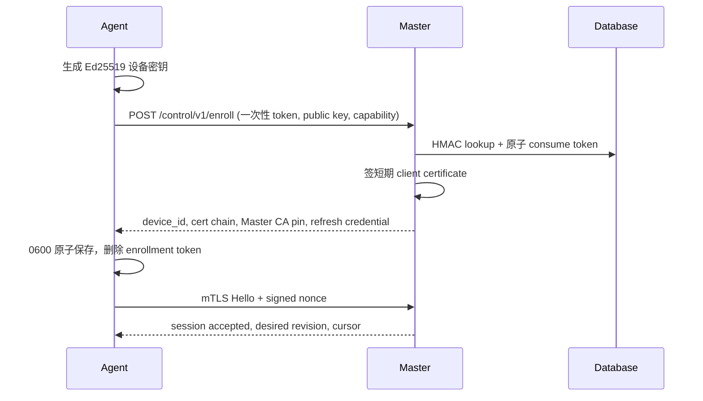
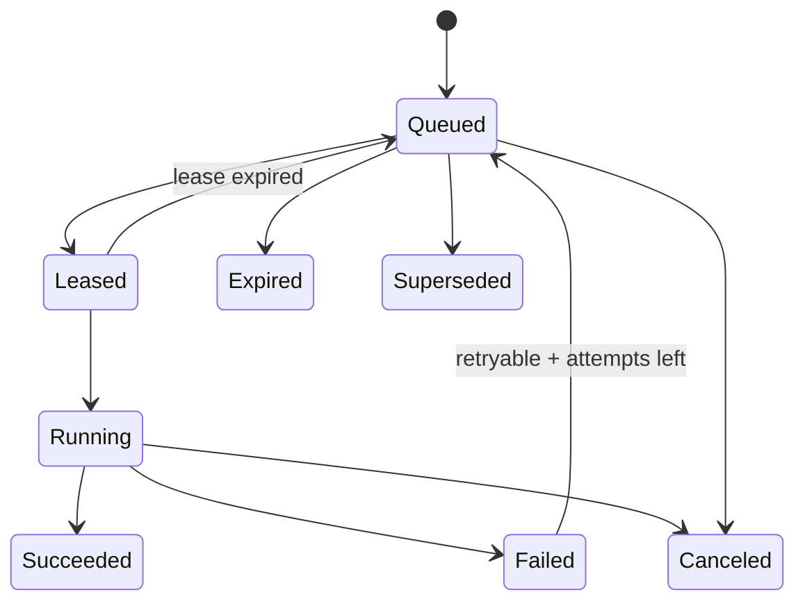

# Agent 协议、任务与状态同步设计

## 1. 目标与版本

协议包名 `nodecontroll.agent.v1`，Protobuf 是唯一 wire schema；WS 使用 binary frames，HTTP/Pull 使用 `application/x-protobuf`，调试 API 可用 canonical JSON。Master/Agent 在 hello 阶段交换：

- protocol major/minor；major 不兼容则拒绝，minor 以双方 capability 交集运行；
- build version/commit/target triple、支持的 task type/version；
- device certificate serial、agent/server ID、boot/session ID；
- sing-box version/build tags/hash/API version；
- OS/kernel/init/cgroup/BTF/tc、Nginx、网卡、目录和权限 capability；
- desired/applied config revision、event outbox cursor、正在运行 task leases。

未知字段按 Protobuf 规则保留/忽略；未知 enum/task type 必须返回 `UNSUPPORTED_CAPABILITY`，不能当 no-op 成功。

## 2. Enrollment 与设备身份



约束：

- enrollment token 256-bit、一次显示、Master 只存 keyed HMAC，绑定 server ID、expiry、max uses=1；
- 设备私钥不离开 Agent；能用 TPM/PKCS#11 时通过 key provider 接口扩展；
- Master 内建实例 CA 默认本地生成并由 master encryption key 保护；支持管理员导入 CA；
- client cert 默认 24 小时，存量连接在 50% TTL 主动轮换；吊销列表与 server disabled 立即拒绝重连；
- HTTP callback 模式还要求 Master client cert，Agent 钉扎实例 CA/instance ID；
- mTLS 之外，每条 envelope 带 session sequence/nonce 和 Ed25519 签名，支持跨 transport重试并防代理层重放。

## 3. 四种连接模式

| 模式 | 连接发起方 | 通道 | 适用 | 约束 |
|---|---|---|---|---|
| `websocket` | Agent→Master | `/control/v1/agent/ws` mTLS/WSS | 默认、实时 push/stream | heartbeat、bounded send queue、resume cursor |
| `pull` | Agent→Master | long poll `GET tasks?after=` + `POST results/events` | 无法稳定 WS 的 NAT/代理网络 | 任务 lease，空响应退避，cursor 持久 |
| `http` | Master→Agent | Agent mTLS HTTPS callback | Agent 有可信可达地址 | 双向证书、callback URL验证、Master job异步不阻塞 API |
| `auto` | Agent 优先 WS | WS失败阈值后 pull；已验证 callback 可由 Master选 HTTP | 默认自适应 | transport epoch，切换不重复 task，恢复 WS 有抖动 |

`HTTP` 与 `Pull` 不混为一谈：前者由 Master 主动调用 Agent，后者由 Agent 主动取任务。所有模式复用同一 envelope、lease、幂等与结果 schema。

### 3.1 Session 状态机

`DISCONNECTED → CONNECTING → AUTHENTICATING → SYNCING → READY → DRAINING → DISCONNECTED`；认证失败进入 `QUARANTINED`，只有新的 enrollment/管理员解禁能恢复。每次连接生成 `session_id` 和 `transport_epoch`。同一 device 只允许一个 active owner；新 session 成功同步后 fencing 旧 session。

## 4. Envelope

```protobuf
message Envelope {
  string message_id = 1;          // UUIDv7
  string device_id = 2;
  string session_id = 3;
  uint64 sequence = 4;            // session 内严格递增
  int64 sent_at_unix_ms = 5;
  int64 deadline_unix_ms = 6;
  string trace_id = 7;
  bytes body = 8;                 // protobuf Any 的受限替代，type 显式登记
  string body_type = 9;
  bytes body_sha256 = 10;
  bytes signature = 11;
}
```

接收端先校验大小（默认 4 MiB，文件使用 chunk 协议）、deadline、session/device、sequence 窗口、body hash、签名，再解码 body。重复 `message_id` 返回既有 ACK/结果；sequence 跳跃触发 gap request，不能静默略过状态事件。

## 5. Durable task 模型

### 5.1 状态机



| 字段 | 说明 |
|---|---|
| `task_id` | UUIDv7，全局稳定 |
| `task_type` / `schema_version` | allowlist executor与 payload schema |
| `server_id` / `device_id` | 目标，派发时验证仍匹配 |
| `desired_revision` | 配置任务 fencing；低于 current 的任务 supersede |
| `idempotency_key` | 同类操作业务唯一键，如 `apply-core:<server>:<revision>` |
| `priority` | system recovery > security > interactive > scheduled > maintenance |
| `not_before` / `deadline` | 调度窗口与绝对过期时间 |
| `lease_owner` / `lease_token` / `lease_until` | 防双执行；结果必须带 token |
| `attempt/max_attempts` | 只对声明 retry-safe 的任务重试 |
| `requested_by` / `reason` | actor 与审计原因 |
| `payload_hash` | payload 不在重试中变化 |
| `result/error/progress` | 结构化，不靠日志推断 |

### 5.2 ACK 与执行

1. Agent 收到 task，先查本地 `task_receipts`；已完成返回原结果，运行中返回当前进度。
2. 验证 capability、deadline、revision、路径/资源 ownership、磁盘/权限前置条件。
3. 本地事务写 receipt=`accepted` 后 ACK；没有持久 ACK 不执行副作用。
4. executor 取得 per-resource lock，进度只允许单调递增并限频。
5. 结果先写本地 outbox，再发送；Master 接受时校验 lease token，但也保存迟到结果为 diagnostic，不让其覆盖新 revision。
6. 收到 Master result ACK 后方可按保留期清理本地记录。

## 6. 类型化任务 allowlist

| 类别 | task type | 主要 payload/result | 幂等/回滚 |
|---|---|---|---|
| 发现 | `CollectCapabilities`,`CollectSystemSnapshot`,`ScanServices`,`ScanPorts` | selector、采样时刻→reported snapshot | 只读，可重试 |
| 内核制品 | `InstallCore`,`UpgradeCore`,`UninstallCore` | artifact manifest/version/hash | stage+atomic switch；保留前版 |
| 内核配置 | `ValidateCoreConfig`,`ApplyCoreConfig`,`RollbackCoreConfig` | revision/json hash/file manifest | check+last-good+health rollback |
| 内核控制 | `StartCore`,`StopCore`,`ReloadCore`,`RestartCore` | expected current state | state reconcile；stop/uninstall 高危 |
| 统计 | `ConfigureStats`,`FlushStats`,`CloseConnections` | epoch/users/filter | query/close结构化结果 |
| 执行策略 | `ApplyTrafficPolicies`,`RemoveTrafficPolicies` | policy revision/class mapping | tc/eBPF snapshot rollback |
| WARP | `InstallWarp`,`RefreshWarp`,`UpgradeWarp`,`UninstallWarp` | Cloudflare credential ref/outbound tags | resource manifest+引用检查 |
| 证书 | `DeployCertificate`,`RemoveCertificate` | encrypted artifact/hash/targets | atomic file+permission+reload rollback |
| Nginx | `DiscoverNginx`,`ApplySite`,`RemoveSite` | owned site model/config hash | `nginx -t`+ownership marker+rollback |
| 测速 | `RunSpeedTest`,`CancelSpeedTest` | node config/source/test plan | sandbox/timeout；无系统副作用 |
| Agent | `StageAgentUpgrade`,`CommitAgentUpgrade`,`RollbackAgent` | signed artifact | helper process/health/previous binary |

明确禁止 `RunShell`、`WriteArbitraryFile`、`ReadArbitraryFile`、`ExecuteURL`。复杂操作只能新增有 schema、路径/命令 allowlist 和测试的 executor。

## 7. Desired/Reported state

每个可协调资源都有：

- `desired_revision`、`desired_hash`、`desired_at`；
- `observed_revision`、`observed_hash`、`observed_at`；
- `phase`: `pending|validating|applying|ready|degraded|failed|unsupported|drifted`；
- `reason_code`、安全脱敏 message、last task ID；
- `conditions[]`: type/status/since/reason/message。

Master reconcile 是 level-triggered，不依赖“某事件恰好送达”：只要 desired != reported 就会重建最新任务；旧 revision task 自动 supersede。Agent 每次启动也主动上报真实状态/hash，发现人工改配置标 `drifted`，默认不覆盖，等待管理员选择“采用远端”或“恢复 desired”。

## 8. Event/metrics outbox

Agent 本地 SQLite 表：

| 表 | 关键字段/作用 |
|---|---|
| `device_state` | device/server/keys/cert/current cursors |
| `task_receipts` | task id/idempotency/payload hash/state/result/retention |
| `event_outbox` | monotonic `event_seq`、type、time、body/hash、acked_at |
| `metric_batches` | boot/core epoch、first/last seq、compressed samples、acked_at |
| `config_revisions` | revision/hash/path/status/created/applied/last_good |
| `artifact_inventory` | type/version/hash/path/verified/current |
| `owned_resources` | kind/id/path/hash/marker，用于安全删除 |

容量由字节和时间双限制。达到 soft limit 先压缩/聚合 metrics，不丢 task/audit/security events；达到 hard limit 进入 degraded 并停止接受会扩大数据的任务。Master ACK 使用连续 cursor + 可选 gap list。

## 9. 文件传输

证书、内核、Agent、备份片段不塞进普通 envelope：

- Master 生成短期、单对象、单用途 transfer grant；
- chunk 默认 1 MiB，每块 hash，整体 size/hash/signature manifest；
- Agent 支持断点、临时目录、空间预检、最大尺寸；
- 下载 URL 通过统一 egress policy；支持 Master relay 和管理员离线上传，官方地址不是必要条件；
- 完整验证后 atomic rename；失败清理只限 transfer-owned temp path。

## 10. 心跳、背压和流控

- WS heartbeat 默认 15 s，45 s 无 ACK判死；有随机抖动；
- control frame 与 bulk metrics 分队列，优先级/容量固定，防止指标淹没控制；
- 每个 Agent 同时运行任务默认 4 个，但 `core_config`、`core_lifecycle`、`nginx_config` 等 resource lock 串行；
- Master 向 session 广播前先取得 database session ownership lease；
- progress 每任务最多 2 Hz；log chunk 总量/行长有限制并服务端脱敏；
- HTTP/Pull 使用 `Retry-After` 和 long-poll timeout，不做忙轮询。

## 11. 错误码

| 类别 | 示例 | 重试 |
|---|---|---|
| `INVALID_ARGUMENT` | config schema/port/field错误 | 否，需改 desired |
| `UNSUPPORTED_CAPABILITY` | core/OS/build tag 不支持 | 否，需升级/换方案 |
| `REVISION_CONFLICT` | 任务落后/远端 drift | 由 reconcile 生成新任务 |
| `PRECONDITION_FAILED` | 磁盘/权限/引用/服务状态 | 修复后可重试 |
| `TRANSIENT_NETWORK` | 下载/DNS/API 暂时失败 | 指数退避 |
| `RESOURCE_BUSY` | 同资源已有任务 | 延后 |
| `DEADLINE_EXCEEDED` | 到期/步骤超时 | 视 task safety |
| `INTEGRITY_ERROR` | hash/signature/cert不匹配 | 不自动重试，安全告警 |
| `ROLLBACK_SUCCEEDED` | apply 失败但现网恢复 | 业务仍失败，需修配置 |
| `ROLLBACK_FAILED` | 新旧都不健康 | critical，停止自动动作 |

## 12. 契约测试

- 所有 Protobuf golden bytes 与 JSON mapping；N-1 minor 兼容；未知 field/enum/task；
- 四 transport 运行同一任务套件，注入断线、重复、乱序、迟到 ACK、session fencing；
- task crash points：ACK前/后、执行中、结果写入前/后、Master ACK前/后；
- enrollment token 重放、过期、错误 server、证书轮换/吊销；
- 1 MB/4 MB边界、zip bomb、hash错、磁盘不足、路径穿越；
- 两 Master replica 争 Agent owner/lease，证明只有一个有效派发者；
- 本地 outbox 24 h离线补传、gap恢复、容量降级不丢 security/task events。
