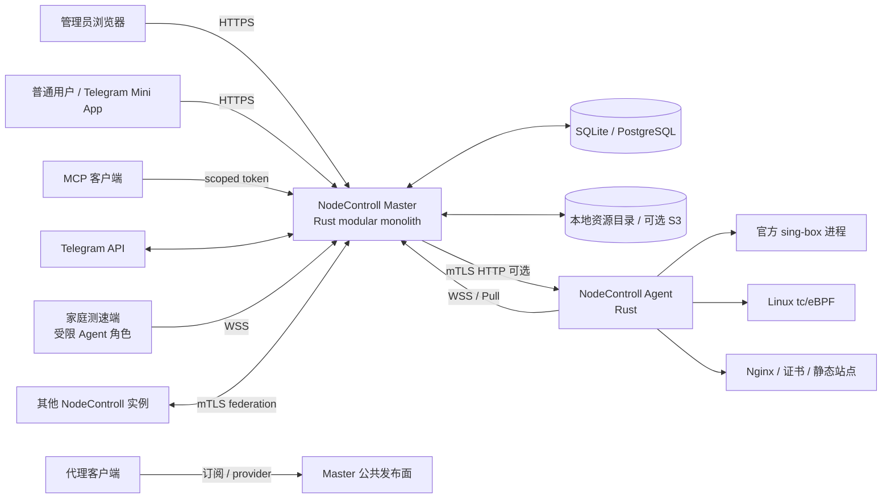

# NodeControll 总体架构

## 1. 架构目标

NodeControll 是一个完全自托管的代理服务控制面：保留妙妙屋成熟的节点、订阅、模板、规则和 provider 能力，补齐妙妙屋 X 的服务器、Agent、内核、用户套餐、流量执行、证书、站点、探针、Telegram、MCP 与实例联合功能。控制面/Agent 后端全部用 Rust，管理端用 Vue 3 + Vuetify，代理数据面只运行官方标准 sing-box。

必须同时满足：

- 无许可证、机器 ID 激活、官方域名/规则服务硬依赖；断网导入本地资源后全部功能可用。
- SQLite 单机简单部署与 PostgreSQL 生产部署使用同一业务行为。
- Master 短时不可用时，Agent 和 sing-box 保持 last-known-good 数据面；任务与计量随后补传。
- 所有远程写操作类型化、幂等、可审计、可回滚，不提供通用远程 shell。
- 配置以领域 IR 为事实源；sing-box JSON、客户端订阅和 Nginx 文件只是可再生物化视图。
- 128 个 `MMW-*`、213 个 `MMWX-*`、10 个 `PRO-*` 与 7 个 `NOLIC-*` 最终均有实现、测试或经批准的标准语义替代。

## 2. 系统上下文



### 2.1 信任域

| 域 | 信任级别 | 主要凭据 |
|---|---|---|
| 浏览器管理面 | 已认证人类用户 | secure session + CSRF；可选 TOTP/Turnstile |
| 公共发布面 | 不可信互联网 | hash subscription token/短码；严格速率与缓存隔离 |
| Agent 控制通道 | 设备身份 | 一次性 enrollment token → Ed25519 设备密钥 + 短期 mTLS 证书 |
| sing-box 本机 API | 仅 Agent loopback | 随机 API secret、Unix socket/loopback、防火墙 |
| 外部内容 | 不可信网络和数据 | 统一 SSRF egress policy、大小/时间/格式/hash 限制 |
| 实例联合 | 另一个管理员域 | 实例证书钉扎 + scoped grant + resource ownership |

## 3. 进程与部署单元

### 3.1 `nodecontroll-master`

一个 Rust modular monolith，按 subcommand 运行：

| 子命令 | 作用 |
|---|---|
| `serve` | Axum HTTP/WS/SSE、嵌入 Vue dist、后台调度器、Agent session hub |
| `migrate` | 升/降级检查与数据库 migration；默认只前进 |
| `doctor` | DB、目录、secret、origin、队列、证书、Agent兼容性诊断 |
| `backup` / `restore` | 一致性备份、校验、dry-run 恢复 |
| `import-mmw` | 妙妙屋迁移的 scan/plan/apply/verify/rollback |
| `admin` | 本机 break-glass 管理员重置、session 撤销、2FA恢复 |
| `openapi` | 生成固定 OpenAPI artifact 供契约测试与前端 client 生成 |

默认一个进程承担 API 与 workers，以降低自托管复杂度。PostgreSQL 模式允许多 replica，但 scheduler/job、Agent session ownership 和 singleton reconcile 使用数据库 lease；SQLite 模式强制单实例。

### 3.2 `nodecontroll-agent`

每台受管服务器一个 Rust 守护进程：

- 设备 enrollment、mTLS 轮换、WS/Pull/HTTP/Auto 连接；
- 类型化任务执行、desired/reported state reconcile；
- 官方 sing-box 制品安装、能力探测、配置生成/check/apply/reload/rollback；
- 统计/连接事件采集、本地持久 outbox、tc/eBPF策略；
- 系统指标、网卡计数、版本、端口/服务/文件 ownership 发现；
- ACME 证书部署、托管 Nginx 站点、WARP/WireGuard 资源；
- 自升级的制品验证、原子替换与回滚。

Agent 数据目录包含自己的 SQLite 状态库，但不保存控制面完整业务数据。Master 断线时只执行已租赁且未过期的任务，不接受本地未审计管理 API。

### 3.3 `nodecontroll-tester`

与 Agent 复用协议、身份和任务 runtime，但用 `role=tester` 能力集构建/运行：只允许节点测速、Mihomo/sing-box 测试沙箱、出口 IP 和延迟，绝不允许系统/内核/Nginx/证书任务。Linux/macOS/Windows 制品分别测试；家庭端反向连接，无需公网入站。

### 3.4 官方 sing-box

独立子进程，不链接进 Rust。Agent 拥有其配置目录和 service unit；完整结论见 [`SINGBOX_COMPATIBILITY.md`](SINGBOX_COMPATIBILITY.md)。每个 Agent 同时只管理一个默认 instance，数据模型保留多 instance key 以便以后扩展。

## 4. Rust modular monolith 边界

依赖方向固定为 `delivery/infrastructure -> application -> domain`；domain 不依赖 Axum、SQLx、Tonic、文件系统或外部 SDK。

| crate | 职责 | 禁止职责 |
|---|---|---|
| `nc-domain` | typed ID、entity/value object、policy、状态机、领域事件和纯计算 | SQL/HTTP/JSON producer/文件 IO |
| `nc-application` | use case、transaction boundary、ports、authorization decision、outbox | 具体数据库或 SDK |
| `nc-db` | SQLx repository、migration、SQLite/PG兼容、lease/locking | 业务 policy |
| `nc-auth` | password/session/TOTP/token/CSRF/RBAC/scopes | UI 路由判断 |
| `nc-secrets` | envelope encryption、key provider、secret reference/redaction | 直接业务查询 |
| `nc-jobs` | durable job、scheduler、lease、retry、workflow/reconcile | 任意 shell executor |
| `nc-audit` | append-only audit、diff摘要、security event | 修改业务实体 |
| `nc-agent-protocol` | Protobuf、envelope、capability、task/result、版本兼容 | Master/Agent具体网络 loop |
| `nc-agent-hub` | session ownership、WS/Pull/HTTP transport、dispatch/ack | task 业务实现 |
| `nc-singbox-ir` | server protocol/route/outbound IR、capability validation | 直接启动进程 |
| `nc-singbox-compiler` | IR→固定版本 JSON、Xray/mmw import diagnostics | 数据库写入 |
| `nc-subscription-ir` | 客户端节点/组/规则/provider 中间模型 | HTTP 鉴权 |
| `nc-producers` | Mihomo/Clash/Surge/Stash/Surfboard/V2Ray/sing-box/QX等输出 | 读取数据库 |
| `nc-traffic` | raw sample、epoch/delta、ledger、倍率、baseline、effective policy | 直接 tc/eBPF 调用 |
| `nc-certs` | ACME order、DNS adapter、证书验证/部署 workflow | 明文永久 secret |
| `nc-federation` | peer identity、grant、child resource ownership、协议 | 绕过正常 Agent任务 |
| `nc-mcp` | MCP transport/tool registry/schema/intent confirmation | 直接 repository 写入 |
| `nc-telegram` | bot update、account binding、Mini App validation、notification | 自建权限系统 |
| `nc-api` | Axum handlers/middleware/RFC7807/OpenAPI/SSE/WS | 业务规则或手写 SQL |
| `nc-master` | composition root、config、startup/shutdown、embedded web | 领域实现 |
| `nc-agent-core` | Agent state/reconcile/executor ports/local outbox | UI/主库访问 |
| `nc-agent-linux` | systemd/OpenRC/procfs/netlink/tc/eBPF/Nginx/atomic file | Master业务 policy |

所有 crate 默认 `#![forbid(unsafe_code)]`；eBPF/系统 syscall 隔离在小型 crate，unsafe 行必须有 safety invariant、Miri/单测和审阅标记。

## 5. 建议仓库布局

```text
NodeControll/
├─ Cargo.toml                       # workspace resolver=3
├─ rust-toolchain.toml              # VPS 固定 stable toolchain
├─ apps/
│  ├─ master/
│  ├─ agent/
│  └─ tester/
├─ crates/
│  ├─ domain/ application/ db/ api/ auth/ secrets/ jobs/ audit/
│  ├─ agent-protocol/ agent-hub/ agent-core/ agent-linux/
│  ├─ singbox-ir/ singbox-compiler/
│  ├─ subscription-ir/ producers/ traffic/
│  └─ certs/ federation/ mcp/ telegram/ observability/ test-support/
├─ ebpf/
│  ├─ nc-shaper-ebpf/
│  └─ nc-shaper-common/
├─ proto/nodecontroll/agent/v1/
├─ openapi/
├─ web/
│  ├─ src/app/ pages/ features/ entities/ shared/
│  └─ tests/
├─ migrations/sqlite/ migrations/postgres/
├─ deploy/docker/ systemd/ openrc/ nginx/ helm/
├─ tests/contract/ integration/ e2e/ protocol/ migration/ performance/
├─ fixtures/mmw/ subscriptions/ singbox/ certificates/
├─ docs/
└─ tools/
```

## 6. 核心数据流

### 6.1 远端配置应用

1. API 接受管理员变更并校验权限、`If-Match` revision 与 idempotency key。
2. application transaction 写 desired entity、`config_revision` 和 domain outbox；不直接等待 Agent。
3. reconcile worker 聚合某服务器短时间内的变化，构建完整 `ServerConfigIR`。
4. compiler 用 Agent capability 验证并生成 sing-box JSON、secret/file manifest、预期 hash。
5. durable job 发 `ApplyCoreConfig`，Agent ACK/lease 后写 `config.next.json`。
6. Agent 执行 `sing-box check`、采集当前 stats、原子保存 last-good、rename、SIGHUP。
7. 通过 loopback API/端口/进程探活并报告 applied revision/hash；失败自动恢复 last-good。
8. Master 写 reported state；SSE 通知 UI。desired != reported 时显示 reconciling/degraded，不假报成功。

### 6.2 订阅发布

1. 公共 endpoint 解析 token/短码，hash lookup 并校验 subject、scope、expiry、silent mode 与限速。
2. 读取用户的有效 package instances、节点/标签 snapshot、文件 ACL 与当前账本 snapshot。
3. 构建 `SubscriptionIR`，依序执行 filtering → rename → entitlement → template merge → custom rules → producer。
4. 对脚本扩展使用禁网、限时、限内存 sandbox；失败按配置 fail-closed 或 last-good。
5. 输出 body、ETag、`Subscription-Userinfo` 与格式 warning headers；缓存 key 包含 subject/revisions/format，禁止跨用户命中。

### 6.3 流量账本

1. Agent 以 `agent_id + core_epoch + sample_seq` 上报网卡 raw counters、内核 user/inbound/outbound counters和 connection deltas。
2. ingest 使用唯一键去重，counter 下降只开启新 epoch，不产生负流量。
3. attribution 将 user label 映射不可变 principal/package instance；多 hop 依据 billing point 去重。
4. ledger append raw delta、direction、source、node、倍率 revision；调整/reset 单独写 event。
5. aggregates 异步生成小时/日/月查询表；策略 evaluator 更新到期/超限/自动限速状态并发 reconcile。

### 6.4 Agent 离线

- 已运行 sing-box、tc/Nginx 不变；Agent 本地保存最多受配置限制的 metrics/outbox。
- Master job 保持 queued，过期任务不会在重连后误执行。
- 重连先交换 capability/current revision/outbox cursor，再补传事件，最后 reconcile 最新 desired；旧 revision job 被 supersede。

## 7. 一致性与事务边界

| 边界 | 策略 |
|---|---|
| 单个业务写入 | DB transaction + optimistic revision + domain outbox |
| DB 与资源文件 | DB 先记录 content hash/staged object；materializer 原子 rename；GC 只删无引用 hash |
| Master 与 Agent | at-least-once envelope + idempotency key + lease；reported state 最终一致 |
| Agent 与 sing-box | local transaction：stage→check→snapshot→apply→health→commit/rollback |
| 计量 | raw event append-only + unique sequence；aggregate 可重建 |
| 通知/MCP/TG | outbox 触发、dedupe key；业务 transaction 不等待第三方 |
| 跨实例分享 | 拥有方是资源事实源；消费方保存 projection/cache，不可转授权 |

不使用分布式事务。所有跨边界操作必须有显式中间状态、幂等、补偿和可观测 deadline。

## 8. 非功能预算

这些是首轮工程目标，最终以 VPS 基准和文档实测值更新：

| 指标 | 目标 |
|---|---|
| API 可用性 | 单机进程健康期间 99.9%；无外部许可证依赖 |
| 普通读 API | p95 < 200 ms（10k users/50k nodes 合成数据，VPS） |
| 订阅生成 | 1k 节点 p95 < 1 s；10k 节点 < 5 s；缓存命中 < 100 ms |
| Agent command | 在线 WS ACK p95 < 2 s；结果按任务类型设 deadline |
| 指标丢失窗口 | 正常 < 10 s；Agent离线本地缓冲至少 24 h/可配置容量 |
| 配置恢复 | check 失败不影响现网；apply 健康失败 30 s 内恢复 last-good |
| 备份 | 默认小型 SQLite 实例 < 5 min；每次生成 manifest/hash |
| 浏览器 | Chrome/Firefox/Safari 当前+前一主版本；移动宽度 360px 可完成核心流程 |
| 无障碍 | WCAG 2.2 AA 核心页面；键盘、焦点、对比度、表单错误 E2E |
| 资源 | Master 空闲目标 < 256 MiB；Agent 空闲目标 < 96 MiB，不含 sing-box |

## 9. 故障矩阵

| 故障 | 系统行为 | 运维可见性 |
|---|---|---|
| DB 不可写 | 所有写 API 503；只读可按连接状态继续；不派新任务 | health=`degraded/db`、结构化错误 |
| 资源盘满 | 阻止上传/备份/更新，保留核心 API；不自动删除用户数据 | disk alert + largest owned resources |
| Agent 断线 | last-good 数据面继续；任务排队/过期 | offline_since、last_error、pending jobs |
| 新配置非法 | `sing-box check` 失败，不 reload | compile/check diagnostics 回到具体字段 |
| reload 后不健康 | 自动回滚 last-good | applied/rollback revision、日志摘要 |
| stats API 不可用 | 不虚构 0；sample 标 missing，账本延迟 | capability degraded + gap interval |
| eBPF/tc 不可用 | strict 限速策略标 unsupported，不假报生效 | enforcement state/reason/remediation |
| 外订阅失败 | last-good + stale 标记；不清空节点 | next retry/error/hash/age |
| ACME/DNS失败 | 保留旧证书，重试并告警 | order state/provider error/expiry risk |
| Telegram/MCP第三方失败 | 业务事务已完成；integration outbox 重试 | delivery attempts/dead-letter |
| 联合 peer 失联 | 消费方不能变更；last projection 可只读，所有写排队/失败 | peer status/grant expiry/audit |

## 10. 明确不采用

- 不把系统拆成需要 Kafka/Redis/Kubernetes 才能运行的微服务；默认一个 Master + 一个数据库 + 任意 Agent。
- 不把 sing-box JSON当数据库 schema，不让 UI 自由编辑任意 JSON绕过领域校验；保留高级 diff/只读预览与受控 external mode。
- 不用前端隐藏作为授权，不让 MCP/TG/分享协议绕过 application service。
- 不用“删除再创建”处理更新；所有实体有稳定 UUIDv7、revision、状态与审计。
- 不使用机器指纹、许可证 feature flag、官方授权/域名库。
- 不承诺 SIGHUP 零中断；配置变更会聚合、校验、可回滚并如实显示影响。
