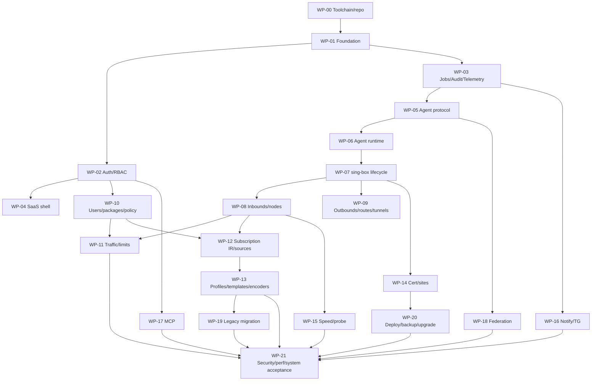

# NodeControll 无商业授权依赖的全功能重构实施计划

## 1. 交付定义与路线原则

最终交付是可独立自托管的完整系统：Rust Master/Agent、Vue 3 + Vuetify 管理端、官方标准 sing-box、SQLite/PostgreSQL、订阅/探针/测速/证书/Nginx/Telegram/MCP/实例联合、社区版迁移和运维工具。妙妙屋 X 的原 PRO 行为全部作为普通功能，不存在商业激活、license key、PRO entitlement、机器激活或官方授权服务、域名、额度、目录依赖。

本计划中的“无许可证/无授权”是产品激活语义，不是放弃开源许可或第三方法律义务。AGPL 和第三方 legal notices 用于说明源码、分发与归属义务，不构成功能限制；数据模型中的本地用户 `entitlement` 表示管理员分配的订阅与资源权限，不等同于 PRO entitlement。

本计划不把“后端接口存在”当完成。一个 work package（WP）必须同时交付 domain/application/storage/API/Agent（若需要）/UI/docs/migration/observability/security/test，并在 VPS 留下可复现 run。所有需求由 [REQUIREMENTS_TRACEABILITY.md](./REQUIREMENTS_TRACEABILITY.md) 的 358 个 source acceptance ID 逐项关闭。

实施原则：

1. vertical slice 先打通，再扩展协议/资源数量；每个阶段都有可运行系统。
2. desired/reported/last-good、job/outbox/audit、scope/secret 是骨架，不后补。
3. 标准 sing-box 通过独立进程和官方 API 集成，不维护私有 fork；不支持项明确诊断。
4. SQLite/PG repository contract 从首个业务表开始双跑，避免末期补 PG。
5. OpenAPI/Protobuf/DB migration/backup 是版本合同，CI 做兼容 diff。
6. 每完成一小包即更新 `docs/00-project/PROGRESS.md`、traceability、实现说明和 VPS run；推进前回看进度/未决风险。

## 2. 目标仓库结构

```text
apps/
  master/                 # Rust HTTP/worker composition root
  agent/                  # Rust remote/local execution composition root
  web/                    # Vue3/Vuetify SPA
crates/
  domain/                 # entities, value objects, policy, state machines
  application/            # use cases, ports, authorization/transactions
  api/                    # axum handlers, DTO, OpenAPI, middleware
  persistence/            # SQLite/PG repositories + migrations
  jobs/                   # durable jobs/outbox/scheduler/workflows
  agent-protocol/         # protobuf/envelope/versioning/transport contracts
  agent-runtime/          # task executor, local store/outbox/capability
  singbox/                # typed config compiler/API adapters/artifact manifest
  traffic/                # ingestion/epochs/ledger/limits/tc coordination
  subscriptions/          # parsers, IR, policy, templates/scripts, encoders
  integrations/           # cert/DNS/Nginx/tester/TG/MCP/federation
  migration/              # legacy detectors/adapters/reconciliation
  telemetry/              # logging/metrics/tracing/redaction
proto/ openapi/ migrations/ fixtures/ e2e/ deploy/ tools/ docs/
```

crate 依赖方向：`domain ← application ← adapters(api/persistence/jobs/agent/integrations) ← apps`。`domain` 不依赖 axum/sqlx/tokio；API DTO 和数据库 row 不渗入 domain。前端只依赖生成 client + UI modules，不复制 domain enum 常量。

## 3. 里程碑和依赖



并行只发生在边界已锁定且不会共同修改同一关键模块时；当前执行仍由本任务持续推进。每个 WP 先提交 schema/contract tests，再实现，最后跑相应 E2E。

## 4. WP-00：远端工具链、仓库和证据流水线

范围：工程骨架、版本锁定、GitHub Actions 正式编译、VPS-only 验收和 commit/artifact provenance。

任务：

- 查询 Rust stable、Node LTS、pnpm、Go/sing-box 官方版本；锁 toolchain/package manager，容器用 digest。
- Rust workspace、Vue/Vite/Vuetify、protobuf/OpenAPI codegen、SQL migrations 和 docs 基础目录。
- GitHub Actions 对 `main` push 的 clean checkout 执行锁文件门、Rust release build、OpenAPI/SDK/Vue production build，并输出带 `BUILD-METADATA`、`CONTENTS.sha256`、license/notices/SBOM 的单个 glibc 2.36 raw tar；Actions 中的合同检查只服务于制品生成，不登记为 VPS 测试通过。
- 每个正式 SHA 在 VPS 使用 `/opt/nodecontroll/checkouts/<sha>` 的 fresh checkout，并将 GitHub 下载的 raw tar 保存在 `/opt/nodecontroll/artifacts/github-actions/<sha>/`；不复用同步工作树作为正式证据来源。
- `tools/vps_verify.sh` 通过 GitHub run/artifact API 核对 push/main、workflow、SHA、run/artifact ID 和 raw tar digest；archive 先过规范路径、重复/别名 member、类型和压缩/单文件/解压总大小门，再检查 metadata、content manifest、ELF/GLIBC。
- VPS 在 fixed image ID 下对 fresh checkout 执行 frozen pnpm install，再以断网、只读 rootfs、只读 source 和只读 Cargo cache 重建 notices；Actions notices 与重建目录按目录/文件全集、size、SHA-256 和实际 bytes 双向比对。之后才运行 format/lint/type/unit/docs、SQLite/PG 和 artifact runtime smoke。
- P5 run 只声明实际生成的 `manifest.json`、`commands.tsv`、`logs/`、`provenance/`、`compiled/`、`checksums.txt`、`COMPLETED_AT`/`FAILED_STAGE`。JUnit、coverage、reports 和浏览器 traces 等到对应 runner 实现后再纳入目录合同。
- `README` 开发入口、AGENTS/贡献规则、变更模板、progress/traceability 更新检查。

完成门：同一个 `main` push commit 先取得成功的 Actions release build；GitHub API digest 与 raw tar SHA 一致，`BUILD-METADATA`/`CONTENTS.sha256`、archive 和 ELF/glibc 门通过；notices 在 VPS 受限环境重收集后逐文件一致，随后该 SHA 的 clean VPS checkout 完成当前静态、双数据库、Web、Master/Agent/OpenAPI artifact smoke。正式证据可追到 commit、workflow run、artifact ID/digest、builder image 和 lock hash，本地不产生通过记录。

## 5. WP-01：基础 domain、配置、数据库和对象存储

需求域：平台/部署底座，后续全部依赖。

实现：UUIDv7/bytes/time/revision/secret refs、typed config、error/problem code、clock/random/hash ports；SQLite/PG pool/migration/repository transaction；filesystem/S3 object port；instances/settings/assets/secrets schema；health/version/license/source API；structured redaction/telemetry minimum。

前端：setup skeleton、错误页、i18n/theme tokens、generated API client、query/session shell。运维：Master native/container、config check、SQLite/PG smoke。

测试：newtype/property、config unknown/secret、migration两库、object hash/atomic、API envelope/problem/ETag、health/readiness、canary secret。

完成门：两数据库 bootstrap→instance/settings/asset CRUD；OpenAPI生成 client；备份所需 manifest primitives 可用。

## 6. WP-02：身份、会话、MFA、角色与用户基础

覆盖：`MMW-AUTH-*`、`MMW-SEC-*` 身份部分、`MMWX-SEC-*`。

实现顺序：

1. empty-instance bootstrap 的数据库原子锁；首 owner/recovery codes。
2. Argon2id calibration/hash/rehash；login challenge；TOTP、WebAuthn、恢复码。
3. server-side sessions、CSRF/Origin、logout/all、recent-auth、trusted proxy/IP rate limit。
4. personal/service API token、scope/CIDR/expiry/rotation。
5. RBAC + object relationship + field projection；owner/admin/operator/support/auditor/member。
6. users lifecycle、password reset、profile/preferences、soft delete/purge job contract。

UI：setup/login/challenge/profile/security/session/token、用户列表/详情/权限状态。审计：所有凭据和角色动作。迁移：legacy password verifier/token policy placeholder。

完成门：E2E-001 和角色/IDOR矩阵；CSRF/session/token/MFA security suite；API永不回显 secret。

## 7. WP-03：durable jobs、outbox、audit、事件和观测

覆盖：社区任务/运维/通知底层及所有远端动作依赖。

实现：job state/steps/attempt/lease/cancel/retry/idempotency；transactional outbox/inbox；scheduler leader lease/jitter；SSE event log/resume；audit append/hash chain/checkpoint/export；notifications domain event hook；metrics/traces/log redaction；retention jobs。

UI：全局 JobChip/Drawer、任务中心、activity、audit diff/logs；刷新后 job 恢复、409 conflict pattern。

测试：worker crash/lease takeover、duplicate effect、cancel race、outbox retry、SSE reconnect/resync、audit tamper/gap、clock skew、SQLite/PG contract。

完成门：示例长任务从 API 202→worker→SSE→终态完整；重启无丢失/重复副作用；audit 能验证/导出。

## 8. WP-04：SaaS 应用壳与共享交互组件

覆盖：`MMW-UI-*`、`MMW-DEPLOY-*` UI、`PRO-009` 品牌。

实现：responsive navigation/context/command palette、permission route projection、DataTable/ResourceHeader/StatusChip/JobDrawer/DangerDialog/SecretField/MetricChart/DesiredReportedDiff/PolicyExplainer、light/dark/brand/i18n、error/loading/empty/stale patterns。

页面先用真实 WP-01～03 API：dashboard health/jobs/audit/users/settings/system。建立 Storybook/gallery、visual snapshots、axe/keyboard/bundle budgets。

完成门：360px/desktop、中英、light/dark；WCAG 自动门和键盘清单；login shell/首屏预算；不存在未生成的手写 API 类型。

## 9. WP-05：Agent protocol、enrollment 和四种连接

覆盖：`MMWX-AGENT-001..018`、平台 Master-Agent 路径。

实现：protobuf v1/envelope、Ed25519 signature、mTLS CA/device cert、one-time enrollment、sequence/replay/expiry/audience、capability/heartbeat/desired/reported、task/file/outbox/flow control；WS/HTTP/Pull/Local transports 共用 compliance core。

Master：server/device/connection/task repositories、APIs、scheduler、status/drift；Agent reference simulator。UI：server create/enrollment stepper、mode、online/capability/rotate/diagnostics。

完成门：四 transport compliance、两个 Agent 隔离、restart/partition/rotation/revoke、N/N-1协议 golden；E2E server enrollment不执行宿主副作用。

## 10. WP-06：Agent runtime、特权 helper 和宿主观测

覆盖：服务器信息/服务控制/文件任务/系统 metrics 等 Agent 能力。

实现：Agent local SQLite desired/reported/task/result/outbox；typed task registry；atomic file/artifact store；systemd service allowlist；system metrics/process/log cursor；separate privileged helper；clock/capability inventory；installer/uninstaller/doctor。

安全：专用用户、固定 paths/unit、无 shell、symlink/openat、stderr/redact/limit；task leases/cancel/rollback。UI server overview/agent/metrics/logs。

完成门：native target VPS 隔离目录中安装/运行/卸载保留；task injection/path/symlink/permission suite；断网缓存结果重传；不碰非 run-ID service/file。

## 11. WP-07：官方 sing-box 制品、配置编译与生命周期

覆盖：`MMWX-CORE-*`、`PRO-001`、`PRO-010`。

实现：official tag builder/manifest/SBOM/license/source；core artifact allowlist/install/upgrade/rollback；managed/external mode；typed config IR/compiler/version capabilities；`check`、atomic desired/reported/last-good；start/stop/restart/reload；V2Ray stats、Clash辅助、1.14 official API adapter；epoch/flush。

UI core/config：版本轨/build tags/capability、semantic/raw diff、compile/deploy/job/rollback/drift。external mode 明确哪些字段只读/不可管理。

完成门：stable+1.14 track 官方 clean build；合法/非法 config；crash/invalid/reload last-good；GPL/source页面；离线 bundle，无私有 fork。

## 12. WP-08：入站、principal 和节点

覆盖：`MMW-NODE-*`、`MMWX-IN-*`、`MMWX-NODE-*`。

实现：inbound/protocol discriminated settings、TLS/Reality/transport、principal credential lifecycle；node publish metadata/tag/order/visibility/bulk/links；capability diagnostics；config compiler 与 deploy debounce。

协议按 slice：

1. Shadowsocks + SSM API、VLESS Vision + TLS/Reality + TCP/WS；
2. VMess/Trojan + HTTP/HTTPUpgrade/gRPC；
3. Hysteria2/QUIC、AnyTLS；
4. Snell v5/v6（只在目标版本）；
5. import-only legacy/external formats，不虚构 server 支持。

UI schema-driven protocol editor/credential rotate/one-time share/QR、list/bulk/test entry。测试真实 client handshake/TCP/UDP/user attribution。

完成门：支持矩阵每个合法组合 `check`+connect；不支持组合 precise 422；XHTTP 不伪装；E2E-003 基础路径。

## 13. WP-09：出站、选择器、路由、WARP、隧道与私有路由

覆盖：`MMWX-OUT-*`、`MMWX-ROUTE-*`、节点链式/relay能力。

实现：direct/proxy/selector/urltest/WARP outbounds；first-match rules/rule-sets/reorder/shadow diagnostics；leastPing native urltest；random/roundRobin/leastLoad 用 selector + Agent scheduler/API，有状态/回退；server-to-server tunnel；user private route/quota/expiry；旧 chain/relay semantic mapping。

UI：outbound health/select、route ordered editor/explainer、tunnel topology+列表、WARP secret/state、private route。测试 actual egress IP/DNS/route match/cycle/failover/existing connection。

完成门：E2E-004；所有策略清晰标 native/Agent-scheduled；Agent offline 保留数据面且 reported 不伪造。

## 14. WP-10：用户、多套餐、entitlement 和策略解释器

覆盖：`MMWX-USER-*`、`MMWX-PKG-*`，并承接社区用户授权。

实现：package CRUD/clone/order；多个 entitlement、周期/到期/pause/reset；节点/协议/source allow/deny；流量、速度、并发、IP、设备策略；override/priority/冲突 resolution；effective policy snapshot/explain；用户 subscription center。

UI：用户/套餐/绑定/effective policy、流量周期/状态/批量动作。所有 “客户端数/连接数/设备/IP” 分列，避免 X 文档语义混淆。

完成门：组合 property tests、时区/周期 boundary、权限、E2E-005 的静态策略部分；策略版本成为订阅和限制输入。

## 15. WP-11：连接、流量账本、自动/实时限制

覆盖：`MMW-TRAFFIC-*`、`MMWX-TRAFFIC-*`、`PRO-002..006`。

实现：V2Ray stats/1.14 connection stream ingest；dedupe/delta/epoch/raw measurement；billing multiplier/baseline/adjust/reverse/aggregate；live/history connections；tc/eBPF flow mapping+HTB/fq；rate/concurrent/IP/device；threshold+hysteresis auto limit/restore；close connection；enforcement reported state。

关键顺序：先完成准确观测/epoch/对账，再开 enforcement；先 TCP/直连，再 Nginx loopback，再 UDP/QUIC；每种 protocol 有 attribution verdict。unsupported/degraded 由 policy 决定拒绝部署或显式降级。

UI：raw/billed 分层、ledger/adjust reason、connections、limit source/state/metrics；dashboard。完成门：known-byte reconciliation、真实吞吐/并发/IP测试、restart/reload/WS/Hy2/UDP、E2E-005/013相关；绝无 false-enforced。

## 16. WP-12：订阅 IR、parser、外部源和 provider

覆盖：`MMW-EXT-*`、`MMW-PP-*`、X source输入能力。

实现：typed IR/protocol/transport/TLS、canonical/fingerprint/dedupe；严格 format detection/parsers；SafeHttp/SSRF/ETag/staging/diff/atomic sync/scheduler；source revisions/items；proxy-provider filter/health/output；legacy nodes adapter。

格式先通用 URI/base64/Clash/Meta/sing-box，再 Surge/QX/Loon/Stash 和源代码 fixture 中全部输入。UI sources/runs/items/diff/provider/preview/capability diagnostics。

完成门：parser property/fuzz、SSRF corpus、source last-good/concurrent sync、provider client import；没有 raw credential/log 泄露。

## 17. WP-13：订阅文件、模板、规则、脚本和多客户端输出

覆盖：`MMW-SUB-*`、`MMW-GEN-*`、`MMW-TPL-*`、`MMW-RULE-*`、`MMWX-SUB-*`。

实现：profile/input/node/tag/rule/template/script/token/grant；deterministic publish/artifact/cache/revoke；built-in/user versioned templates；rule libraries/remote sync；pure template engine；WASM transform sandbox；base64/Clash/Meta/sing-box/Surge/QX/Loon/Stash/Shadowrocket/v2rayN/v2rayNG/provider encoders；client capability profiles。

UI pipeline preview/diff/diagnostics、versions/tokens/QR/client buttons、generator、template/rule/script editors。保留 community 功能语义但用一套 IR。

完成门：所有 encoder golden/round-trip/真实客户端互操作；cross-user cache/revoke；script escape tests；E2E-006。

## 18. WP-14：证书、DNS provider 和 Nginx 站点

覆盖：`MMWX-CERT-*`、`MMWX-SITE-*`。

实现：ACME account/order/challenge/certificate state；Cloudflare/Ali/Tencent/Namesilo adapters + manual/import；renew scheduler/jitter；typed site/upstream/transport profiles；Nginx render/validate/atomic deploy/rollback；cert deploy references。

UI certificate/site list/detail/events/secret refs/diff/jobs。fake provider/acme，随后至少一个用户控制测试域真实互操作（不成为运行依赖）。

完成门：DNS/HTTP challenge、renew/expiry alert、invalid config/rollback、WS/HTTPUpgrade real traffic、secret scan；E2E-008。

## 19. WP-15：测速器、节点测速和公开探针

覆盖：`MMW-SPEED-*`、`MMW-PROBE-*`、`MMWX-SPEED-*`、`MMWX-PROBE-*`、`PRO-007`。

实现：tester one-time pairing/heartbeat/capability；speed targets/runs/samples/concurrency/progress/history/IP；local/remote executor；public probe allowlist projection/public IDs/cache/rate/quota/test jobs；instance badge 取代 license badge。

测速流量是否计账为显式 policy；结果展示样本/失败率，不用峰值冒充。公开 target 不能任意扫描/SSRF。

完成门：local+remote/batch/single+8-thread（若保留此选项）/cancel/offline；projection snapshot无私有字段；abuse suite；E2E-007。

## 20. WP-16：通知、Webhook 与 Telegram

覆盖：`MMW-NOTIFY-*`、`MMWX-NOTIFY-*`、`MMWX-TG-*`。

实现：domain event→rule→template→delivery/outbox；webhook/Telegram adapters、dedupe/retry/quiet hours；Bot pairing/commands/callback；Mini App initData verification/short session/用户订阅中心 projection。

通知覆盖 Agent/core/job/traffic/limit/cert/source/backup/security。UI rule/channel/delivery/test，secret 一次性/轮换。

完成门：fake Telegram/webhook success/429/5xx/timeout/replay/signature；身份不靠 chat ID隐式授权；E2E-009通知部分。

## 21. WP-17：MCP server 与工具安全

覆盖：`MMWX-MCP-*`。

实现：独立 MCP adapter/auth/client/tool allowlist；按 X 文档 26 工具逐项映射到 application use case，补充资源读取工具；typed schema、pagination、errors、audit；写/危险工具 confirmation workflow；untrusted text isolation。

UI MCP clients/scopes/tools/invocations/confirm/rotate/revoke；CLI/标准 client互操作。

完成门：工具清单数量和语义对账；read/write/confirm/expiry/replay/confused deputy/prompt injection；MCP不能获得浏览器 session隐含权限。

## 22. WP-18：实例联合和分享服务器

覆盖：`MMWX-SHARE-*`、`PRO-008`、`NOLIC-006`。

实现：peer handshake/pin/key rotate/revoke；signed/replay-safe federation envelope；share projection/scope/quota/expiry；consumer import immutable reference；拥有方管理、消费方可建受限资源；禁止二次转授；offline/last-known/reconciliation。

两套 NodeControll 实例本地启动完成 E2E；没有全局账号/官方目录/许可证。UI peer/share/import/usage/audit/revoke impact。

完成门：E2E-010、wrong audience/replay/revoke/owner offline/consumer abuse；双方断互联网（除彼此）仍可运行。

## 23. WP-19：社区版/X 迁移工具和切换

覆盖：社区备份/恢复/所有 legacy persistence，平台迁移要求。

实现 [MIGRATION.md](./MIGRATION.md)：safe archive、manifest/inspect/plan/hash/confirm/run/mapping/quarantine/report；社区 26 表逐域 adapters；密码兼容；node/订阅 semantic diff；traffic baseline epoch；blue/green cutover/rollback CLI。

X adapter 只在得到真实合法备份和 schema fingerprint 后实现。无法验证时保持 detector/inventory 状态并在进度文档列明，不以公开文档伪造导入完成。

完成门：empty/small/complex/corrupt fixtures，旧 DB hash 不变，行去向 100%，semantic diff解释率100%，E2E-011。

## 24. WP-20：备份恢复、安装、升级和发布制品

覆盖：`MMW-OPS-*`、`MMW-DEPLOY-*`、`MMWX-PLAT-*` 部署/品牌/存储部分、`NOLIC-001..007`。

实现：encrypted backup/manifest/read-back/inspect/restore；native+Compose single/split；systemd hardening；doctor/installer/uninstaller；Master/Agent/core/config/DB N/N-1 upgrade/canary/rollback；offline release bundle；SBOM/license/source/provenance。

静态/动态 no-license 验收：仓库/制品/网络 capture 不出现激活域/机器许可；断开公网后用本地 bundle完成 setup、Agent、core、用户、订阅、限速、联合（两机互联即可）。

完成门：E2E-012/014；前版升级；backup新实例恢复；卸载保留/purge scope；native/Compose/split从零。

## 25. WP-21：全量验收、安全、性能和交付

执行 [TEST_PLAN.md](./TEST_PLAN.md) 全套：E2E-001～015、协议/客户端矩阵、SEC-001～024、ASVS 5.0 L2、24h soak、目标规模/API/订阅/traffic/fleet性能、故障注入、backup/upgrade/rollback、a11y/visual/mobile。

关闭全部 traceability `implemented→verified`；任何延期必须是外部不可获取证据且不影响用户要求，并由用户明确接受，否则继续实现。清理 docs 中过时假设，生成管理员/用户/Agent/迁移/API/MCP/runbook文档、release note、checksums/SBOM/source。

完成门：干净 commit 在 VPS 全绿；所有功能无官方授权/域名依赖；部署和恢复可复现；进度文档含实际代码模块、run IDs、已知限制（目标应为空或明确不影响需求）。

## 26. 跨 WP 的编码规则

### 26.1 Rust

- public functions/domain use cases 按 [RUST_BACKEND.md](./RUST_BACKEND.md) 实现；禁止 handler 写业务事务。
- `unsafe` 默认 deny，必要时（主要 eBPF FFI）封装小模块、安全不变量文档+Miri/专项测试。
- `unwrap/expect/panic` 禁止进入请求/worker/Agent不可信路径；checked arithmetic；error code typed。
- async 不持 DB transaction 跨外部/Agent调用；outbox 保证提交后执行。
- secret 类型不可 Debug/Serialize；PII/log字段 allowlist。

### 26.2 Vue

- route 按 [FRONTEND_UX.md](./FRONTEND_UX.md)；generated API client；server state用 Query、client state用 Pinia。
- 每页面同 PR 交 loading/empty/error/stale/permission/capability/mobile/i18n/a11y。
- destructive action=impact→reason/re-auth/confirm→job→terminal，禁止 optimistic success。

### 26.3 DB/API/protocol

- 所有 schema 变更 migration+SQLite/PG contract+upgrade/rollback；无通用 JSON逃生口保存核心字段。
- OpenAPI 3.1、Protobuf、backup format 兼容 diff；secret GET projection统一。
- external/Agent side effect 均 durable job/outbox/idempotent/reported/audit/rollback。

## 27. 风险台账和决策门

| 风险 | 决策/缓解 | 关闭条件 |
|---|---|---|
| sing-box 1.14 stable 尚未发布（设计日） | stable 1.13 + pinned 1.14 preview 双轨；不私改 source | 官方 stable锁定并全矩阵通过，或发布明确 preview |
| 标准 sing-box 无 generic user CRUD/rate limiter | config revision + official events/API + tc/eBPF；SSM只用于SS | 各协议动态策略/部署影响/限速真实E2E |
| XHTTP 非标准能力差异 | 明确 unsupported/migration到HTTP/Upgrade；不伪装 | UI/API diagnostic + import behavior测试 |
| tc/eBPF/UDP/多路复用归属 | capability/degraded、native fallback、逐协议实测 | no false-enforced，目标kernel矩阵通过 |
| X core/Agent源和DB schema不可见 | X功能依据58页文档；迁移adapter需真实样本 | 用户授权样本或明确不声称X直接导入 |
| 358需求规模导致遗漏 | machine traceability、每WP ID query、发布0未映射 | coverage checker全绿 |
| SQLite到HA语义差 | 从首表双repository contract；HA单独故障/soak | PG failover/lease/duplicate effect通过 |
| 自定义脚本RCE | 不执行旧JS；WASM无WASI+fuel | sandbox escape/canary suite通过 |
| 远端执行高风险 | typed Agent tasks+最小helper+last-good | SEC Agent矩阵/独立复核通过 |

## 28. 进度维护节奏

每次推进前读取 `docs/00-project/PROGRESS.md` 的当前阶段、最近 run 和未决风险。每完成一个可验证 slice：

1. 更新代码说明（模块/关键函数/状态变化/迁移）；
2. 更新 traceability 的 plan/implementation/test/status/run；
3. 在 VPS 跑最小相关门并记录 run ID/结果，失败也记；
4. 更新风险/设计偏差和下一步；
5. 到 WP gate 再跑干净全量 stage，满足后才标完成。

项目不会因文档完成、骨架可编译或 UI 页面齐全而结束；只有 WP-21 的系统证据满足用户全部要求才进入最终交付。
