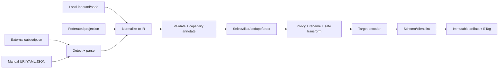

# 订阅解析、规范化与生成中间表示（IR）

## 1. 目标与非目标

所有本地节点、sing-box 入站、外部订阅、proxy-provider、实例分享和手工 URI 必须先进入同一 typed IR，再经过选择、重命名、去重、策略和目标编码。NodeControll 不再维护“普通订阅生成器”和“模板生成器”两套含义不同的协议结构。

IR 的目标是：无损保留可表达字段；明确记录来源与降级；相同固定输入产生逐字节相同输出；模板不能读取数据库或任意网络；任何客户端不支持的特性都产生 diagnostic，而不是静默生成一个看似有效的错误节点。

IR 不是 sing-box JSON 的别名，也不是永久保存第三方原始密钥的日志格式。原始 payload 只进入加密/受限对象存储并按保留策略删除。

## 2. 流水线



每次 publish 固定：IR schema version、全部 source revision/content hash、node revision、package/entitlement revision、模板版本、规则版本、脚本版本、encoder version 和 target capability profile。任一输入变化都得到新 artifact hash。

## 3. 顶层 IR

```text
SubscriptionIr {
  schema_version,
  generated_for: PrincipalRef?,
  nodes: Vec<NodeIr>,
  groups: Vec<GroupIr>,
  rules: Vec<RuleIr>,
  dns: DnsIr?,
  options: ClientOptionsIr,
  provenance: ProvenanceSet,
  diagnostics: Vec<Diagnostic>
}
```

`NodeIr`：

```text
NodeIr {
  id: StableNodeKey,
  source: SourceRef,
  display: { name, emoji?, tags, region?, provider?, sort_key },
  endpoint: { host, port, resolved_ip_hint? },
  protocol: ProtocolIr,
  transport: TransportIr,
  tls: TlsIr?,
  multiplex: MultiplexIr?,
  udp: UdpCapability,
  routing_hints: RoutingHintSet,
  health: HealthProjection?,
  constraints: NodeConstraintSet,
  extensions: BTreeMap<NamespacedKey, JsonValue>
}
```

`extensions` 只接受登记过的 namespace，如 `clash.meta/*`、`sing-box/*`；encoder 必须显式声明读取哪些扩展。未知扩展会被保留但不自动输出，防止字段注入。

## 4. 协议 IR

`ProtocolIr` 是封闭的 discriminated enum；敏感字段在运行期用 `SecretValue`，Debug/Serialize 默认 redacted：

| 类型 | 必需字段 | 可选/约束 |
|---|---|---|
| `Shadowsocks` | method,password | plugin、plugin_opts；2022 method 校验 key 长度 |
| `Vmess` | uuid,security | alter_id（只为兼容）、packet_encoding |
| `Vless` | uuid | flow=`xtls-rprx-vision`、packet_encoding |
| `Trojan` | password | 无 TLS 时默认 fatal，除非目标明确允许 |
| `Hysteria2` | password | up/down Mbps、obfs salamander、ports；要求 TLS |
| `AnyTls` | password | idle/min idle/padding scheme；要求 TLS |
| `Snell` | psk,version | v5/v6；obfs 与版本能力检查 |
| `Hysteria1Legacy` | auth | 仅外部订阅/老客户端输出，不生成新 sing-box 入站 |
| `Tuic` | uuid,password,version | 外部/客户端格式支持；不假定 server 入站已实现 |
| `Socks` | username?,password? | 只用于私有/受信用途，默认不公开发布 |
| `Http` | username?,password? | TLS 由 `TlsIr` 表达 |
| `WireGuard` | private_key,peer_public_key | local addresses、reserved、mtu |
| `Ssh` | user,auth ref | 只作受限出站，禁止导出 private key |
| `Direct/Block/Dns` | tag semantics | 只在 sing-box 配置 IR，订阅 node 集排除 |

“支持解析”不等于“允许新建服务端入站”。能力由三层交集决定：NodeControll encoder、目标客户端 profile、指定 sing-box build/version。UI 必须展示三者中阻断的一层。

## 5. Transport、TLS 与 Reality

`TransportIr`：

- `Tcp`：raw TCP；header/obfs 作为显式兼容字段。
- `WebSocket { path, host_headers, early_data_header?, max_early_data? }`。
- `Http { path, host_headers, method? }`：映射 sing-box HTTP transport，不伪装 Xray XHTTP。
- `HttpUpgrade { path, host_headers }`。
- `Grpc { service_name, idle_timeout? }`。
- `Quic`：仅目标协议/客户端和服务端能力都允许时输出。
- `KcpLegacy`、`DomainSocketLegacy`、`XhttpUnsupported`：可解析旧输入并生成诊断；标准 sing-box server target 不可部署。

`TlsIr`：`enabled,server_name,alpn,certificate_verify,utls_fingerprint?,ech?,reality?`。`RealityIr` 包含 public key、short ID、spiderX 和 server-only secret ref；订阅输出永不包含 private key。`certificate_verify=false` 必须由策略显式允许，并产生 warning。

任何默认值必须在 normalize 阶段物化并附 `default_source=parser/client_profile/admin_policy`，防止 encoder 各自猜测。

## 6. 稳定身份、去重与冲突

节点 key 优先级：

1. 本地/联合对象不可变 UUID；
2. 外部 source ID + source-provided stable ID；
3. canonical protocol fingerprint 的 keyed BLAKE3（实例 salt，不能反推 credential）。

fingerprint 包含 endpoint、protocol、credential hash、transport、TLS/Reality public material，不包含显示名、测速和排序。去重策略可选 `none/exact/endpoint_protocol/prefer_healthy/prefer_local`，但必须返回被合并项和理由。

重名在 selection 后解决：保留首项；后续依规则追加 region/provider/短序号。输出名称经过目标格式的字符、字节和唯一性限制，映射写入 artifact manifest，便于排障。

## 7. Source 检测与解析

探测顺序不是“失败就随便当 base64”：

1. HTTP Content-Type、显式 source format 与配置 override；
2. JSON/YAML 顶层 schema signature；
3. UTF-8 明文 URI line set；
4. 严格 base64/base64url 解码后重复 2/3；
5. 不匹配即 `FORMAT_UNKNOWN`，保存受限样本 hash 和安全摘要。

必须支持的输入族：通用 URI 列表、Clash/Clash.Meta YAML、sing-box JSON、Surge、Quantumult X、Loon、Stash，以及实现期从妙妙屋 parser fixture 确认的旧格式。解析器限制 payload、YAML alias/depth、节点数、字符串长度和 decode 次数；禁用 YAML custom tags。

每项解析返回 `Parsed<T> { value?, diagnostics, consumed_range, raw_fingerprint }`。单个坏节点可按 source policy `reject_all/skip_invalid`；默认首次导入 reject-all，周期同步可在有效率阈值以上 skip-invalid，但 UI/通知必须显示差异。

## 8. 外部抓取安全与缓存

- 只允许 `https`，管理员可显式允许 `http`；禁止 `file/data/gopher` 和 URL userinfo 明文保存。
- 解析 DNS 后阻断 loopback、link-local、multicast、metadata 和私网地址；显式 allowlist 才可访问私网。每次 redirect 和连接实际 peer 均重验，防 DNS rebinding。
- 最多 5 次 redirect、10 MiB compressed/50 MiB expanded、10 秒 connect/30 秒 total；限制压缩比和节点数。
- 使用 ETag/Last-Modified；304 只复用已验证 active revision。200 响应先进入 staging，parse/validate/diff 成功后原子激活。
- 记录状态、duration、byte count、content hash、item count、diff 和安全错误；Authorization、query token、body、解析后 credential 永不写日志。
- 同一 source 同时只有一个 sync lease；scheduler + 手动触发折叠为同一 job。

## 9. 选择、套餐与私有节点

选择阶段接收不可变 `PublishContext`：principal、entitlements、有效时间、设备、profile、target、now-bucket。顺序如下：

1. 删除 source/node disabled 或已删除项；
2. 套餐 node/tag/source allow/deny；
3. 用户私有路由、到期和独立配额；
4. protocol/client capability；
5. health policy（可选择隐藏 unhealthy，默认只标注）；
6. filter expression；
7. dedupe/name/order/limit；
8. 注入 group/rule/DNS 引用并验证无悬空节点。

客户端拿到节点不代表服务端绕过额度。流量、速度、并发和连接/IP 限制仍由服务端 policy enforcement；订阅只是投影。

## 10. 模板与安全转换脚本

### 10.1 模板层

内置模板是仓库版本化资产；用户模板 fork 后独立版本，不在升级时覆盖。模板可读取只读的 `TemplateContext { ir, target, principal_projection, brand, now_bucket }`，不能读取 DB、环境变量、文件、网络或 secret registry。

模板函数使用 allowlist：JSON/YAML 构造、字符串/列表/映射纯函数、CIDR/domain helpers、稳定排序和 capability predicates。限制 AST、递归、输出、CPU 和内存。模板报错带模板行列和 IR pointer。

### 10.2 自定义脚本层

需要比模板更强的转换时使用 WebAssembly component（不执行 JavaScript/Python/shell）：

- 无 WASI filesystem/network/clock/random；只暴露 deterministic host ABI。
- 输入/输出是 versioned canonical CBOR IR；fuel、memory、wall time、输出大小受限。
- module 按 hash/version 审核、签名并绑定 profile；所有运行记录 module hash。
- 脚本不能读取 credential 明文，除非某个明确的 encoder 阶段需要并通过最小 `SecretHandle`；通用 transform 只见 opaque handle。

## 11. 目标编码器与能力 profile

首批 encoder：

| Target | 输出 | 验收重点 |
|---|---|---|
| `base64-uri` | URI 每行 + base64 | RFC/客户端 escaping、fragment、IPv6 bracket |
| `clash` | Clash YAML | proxy/group/rule 引用、YAML 安全字符串 |
| `clash-meta` | Mihomo/Meta YAML | Reality、Hy2、AnyTLS 等 profile gated |
| `sing-box` | client JSON | schema version、route/DNS/outbound tag |
| `surge` | Surge text | policy groups、unsupported diagnostic |
| `quantumult-x` | QX text | escaping/obfs/TLS capability |
| `loon` | Loon text | plugin/options/name uniqueness |
| `stash` | Stash YAML | Clash-like 差异 profile |
| `shadowrocket` | URI/profile | UA/version compatibility |
| `v2rayn` | URI/subscription | Windows client variants |
| `v2rayng` | URI/subscription | Android variants |
| `proxy-provider` | YAML/JSON provider | node-only，无规则/用户信息 |
| `raw-json` | 安全 IR projection | 仅管理导出，secret policy explicit |

能力 profile 使用 `target + semver range` 标识，列出 protocol、transport、TLS、field、最大项/名称限制。UA 只能选择 profile，不能绕过 entitlement。未知 UA 使用管理员选定默认 profile；支持 query override 需要 profile allowlist。

编码器返回 `ArtifactDraft { bytes,mime,filename,diagnostics,manifest }`。任何 fatal diagnostic 阻止发布；warning 可由 profile policy 升级为 fatal。

## 12. 缓存、个性化与撤销

artifact cache key：

```text
BLAKE3(schema | profile revision | principal policy revision | target profile |
       ordered input hashes | template/rule/script/encoder versions | safe locale/brand)
```

响应 ETag 使用 artifact content hash。个性化 artifact 设 `Cache-Control: private,no-cache`；不含用户差异且管理员明确允许的公开 artifact 可设短时 `public,max-age`。下载 token revoke/用户禁用/entitlement 过期先在授权层拒绝，即使 artifact 仍在对象存储。

生成失败不覆盖 last-good artifact；管理员可选择失败时返回 last-good，但响应必须带 `Warning` 和内部告警，且绝不跨用户复用。

## 13. 可观测性与隐私

指标：fetch duration/status、parse item/error、IR validation、publish duration/cache hit/artifact size、encoder diagnostic、download status/bytes/rate-limit。label 不包含 URL、token、用户名字、节点名字或 high-cardinality ID。

访问日志中的 `/sub/{token}` token 必须在路由 middleware 前替换为 hash prefix；Referer policy `no-referrer`。artifact manifest 只向有 `subscriptions:diagnose` scope 的管理员展示，普通用户只看到格式、更新时间、节点数和安全错误。

## 14. 测试语料与发布门

- 从妙妙屋现有测试/实现提取合法与畸形 fixture，剥离真实 credential，形成 `fixtures/subscriptions/<format>`。
- 每个协议至少覆盖 IPv4、IPv6、IDN、特殊字符、空/超长名字、TLS/Reality、每种 transport 和未知字段。
- parser property tests：永不 panic、bounded resource、parse→canonical→parse 等价；fuzz 输入包括 base64/YAML/JSON/URI。
- encoder golden tests 在容器中用目标客户端可用的 schema/linter 验证；无 linter 的格式实现独立 decoder round-trip。
- 固定输入输出 byte-for-byte deterministic；跨 SQLite/PG、时区、locale 和进程重启一致。
- security tests 覆盖 SSRF/redirect/rebinding、zip bomb、YAML bomb、template/script escape、secret Debug/log、token cache 混用。
- compatibility matrix 每次发版给出新增/降级/移除字段；已有 target profile 的输出变化必须显式更新 golden 并 review。

实现完成定义不是“生成一段文本”，而是：每个目标格式都有 capability table、diagnostic、fixture/golden、回读验证、缓存/撤销测试和至少一个真实客户端互操作记录。
